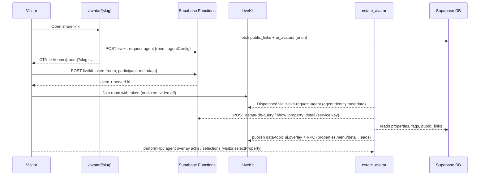

# Realestate Gulf AI - Architecture

## System View
```mermaid
flowchart LR
  User[Visitor/Admin] -->|Browser + Mic| NextApp[Next.js 16 (App Router)]
  NextApp -->|Supabase JS (anon)| SupabaseDB[(Supabase Postgres + Views)]
  NextApp -->|Edge Fn calls| SupaFns[[Supabase Edge Functions<br/>estate-db-query<br/>estate-crm-create-lead<br/>estate-crm-log-activity<br/>conversation-summary<br/>livekit-token<br/>livekit-request-agent]]
  SupaFns --> SupabaseDB
  NextApp -->|LiveKitRoom + data channel| LiveKit[(LiveKit Cloud)]
  LiveKit <-->|Agent dispatch| Agent[Python estate_avatar<br/>(OpenAI Realtime + Anam)]
  Agent -->|Service key| SupabaseDB
  Agent -->|RTC media| LiveKit
  NextApp -->|Share link /rooms| Visitors
```

## Component Interaction (avatar funnel)


## Written Overview
- **Frontend**: Next.js App Router with client components. Supabase JS (anon key) is used directly for dashboards (lead_overview, activities, intent views) and for public avatar landing. LiveKit React components render the room, video track, overlay, and control bar.
- **Backend**: Supabase Edge Functions encapsulate privileged actions (property search/detail, lead/activities mutations, conversation summarization, LiveKit token minting, agent dispatch). RLS keeps anon reads limited to enabled public_links/active ai_avatars.
- **Agent runtime**: `agents/estate_avatar.py` (Python, LiveKit agent) joins the room with OpenAI Realtime + Anam video. It calls Supabase functions for property KB reads and CRM writes, then broadcasts overlay payloads on the LiveKit data channel.
- **Data flow**:
  - Admin console calls Supabase tables/views directly (CRUD for leads, properties, FAQs, avatars, public_links).
  - Public avatar: landing loads `public_links` + `ai_avatars`, ensures agent dispatch, then the room retrieves a LiveKit token via edge fn and joins. The agent pushes property menus/details and lead events; visitor selections are echoed back via RPC.
- **External services**: LiveKit (media + data), OpenAI Realtime (LLM/TTS), Anam (avatar render), Supabase (auth, Postgres, edge fn).
